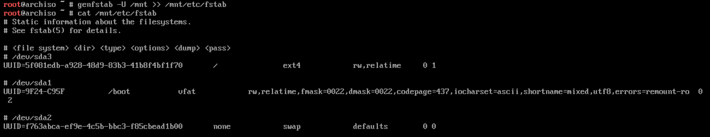

# Easy Arch Linux Installation Guide

## Table of Contents

## Download Arch Linux ISO

1. Go to the [Arch Linux download page](https://archlinux.org/download/).
2. Download the latest ISO file. 🤯🤯
3. Verify the checksum of the downloaded ISO file to ensure its integrity. (Optional but recommended)
   - Use the command: `sha256sum archlinux-YYYY.MM.DD-x86_64.iso` (replace with your ISO file name).
   - Compare the output with the checksum provided on the Arch Linux download page.

## Create a Bootable USB Drive

### Windows

1. Download and install [Rufus](https://rufus.ie/) or [Balena Etcher](https://www.balena.io/etcher/).
2. Insert a USB drive (at least 2GB).
3. Open Rufus or Balena Etcher.
4. Select the downloaded Arch Linux ISO file.
5. Choose the USB drive as the target.
6. Click "Start" or "Flash" to create the bootable USB drive.

### MacOS

1. Download and install [Balena Etcher](https://www.balena.io/etcher/).
2. Insert a USB drive (at least 2GB).
3. Open Balena Etcher.
4. Select the downloaded Arch Linux ISO file.
5. Choose the USB drive as the target.
6. Click "Flash" to create the bootable USB drive.

### Linux

1. Open a terminal.
2. Insert a USB drive (at least 2GB).
3. Identify the USB drive using `lsblk` or `fdisk -l`.
4. Unmount the USB drive if it is mounted: `umount /dev/sdX1` (replace `sdX1` with your USB drive identifier).
5. Use the `dd` command to create the bootable USB drive:

   ```bash
   sudo dd if=archlinux.iso of=/dev/sdX bs=4M status=progress && sync
   ```

   Replace `archlinux.iso` with your ISO file name and `/dev/sdX` with your USB drive identifier.

6. Wait for the process to complete.

## Boot from the USB Drive

1. Insert the bootable USB drive into your computer.
2. Restart your computer.
3. Access the BIOS/UEFI settings (usually by pressing `F2`, `F10`, `Del`, or `Esc` during boot).
4. Change the boot order to prioritize the USB drive.
5. Save the changes and exit the BIOS/UEFI settings.

Your computer should now boot from the USB drive, and you will see the Arch Linux installation menu.

## Installation

### Booting the Live Environment

1. Select "Arch Linux install medium (x86_64)" or similar from the menu.
   

2. Wait for the system to boot into the Arch Linux live environment (see picture).
   

3. Change the keyboard layout if necessary:

   ```bash
   loadkeys us
   ```

   Replace `us` with your desired keyboard layout. (You can see available layouts with `localectl list-keymaps`. I will be using `de` for the German layout.)

4. Connect to the internet:

   - For wired connections, it should automatically connect. (There might be issues on MacBooks, try looking on arch forums or something.)
   - For Wi-Fi, use the following command:

     ```bash
     iwctl
     ```

     Then, use the following commands in the `iwctl` prompt:

     ```bash
     station device scan
     station device get-networks
     station device connect SSID
     ```

     Replace `device` with your wireless device name and `SSID` with your Wi-Fi network name.

5. Verify the internet connection:

   ```bash
   ping -c 3 archlinux.org
   ```

   If you receive replies like in this picture, your internet connection is working.
   

6. Update the system clock:

   ```bash
   timedatectl set-ntp true
   timedatectl
   ```

   The output won't show your local time, it will show UTC time. We will change the time zone later.
   

### Disk Partitioning/Formatting

#### Partitioning

- Type `lsblk` to list the available disks and their partitions.
- Identify the disk you want to install Arch Linux on (e.g., `/dev/sda`).
  
- Use `cfdisk` (or `fdisk`, but I recommend cfdisk) to partition the disk:

  ```bash
  cfdisk /dev/sda
  ```

  - Select `gpt` for the partition table type.
    
  - Controls:
    - Use the arrow keys to navigate. Up & Down to select the partitions, Left & Right to select the options (at the bottom).
    - Press `Enter` to select an option.
  - Now create the following partitions:
    1. **EFI System Partition** (ESP):
       - Size: `1G`<br>
         
       - Type: `EFI System`<br>
         
    2. **Swap Partition** (optional, if you want swap):
       - Size: Typically 1x or 2x your RAM size (e.g., if you have 8GB of RAM, use 8G or 16G).
       - Type: `Linux swap`
    3. **Root Partition** (`/`):
       - Size: Use the remaining space on the disk (just press enter on the default value).
       - Type: `Linux root (x86-64)`
  - Should look like this:
    
  - After creating the partitions, select `Write` to save the changes and confirm by writing `Yes`.
  - Select `Quit` to exit `cfdisk`.
  - (maybe run `clear` to clear the terminal screen)

#### Formatting Partitions

- Run lsblk again to see the partitions you just created:

  

- Format the EFI System Partition to FAT32 (ESP, the 1G big partition):

  ```bash
  mkfs.fat -F 32 /dev/sda1
  ```

- Format the root partition to ext4:

  ```bash
  mkfs.ext4 /dev/sda3
  ```

- If you created a swap partition, make it a swap partition:

  ```bash
  mkswap /dev/sda2
  swapon /dev/sda2
  ```

  

### Mounting Partitions

- Mount the root partition:

  ```bash
  mount /dev/sda3 /mnt
  ```

- Mount the EFI System Partition (--mkdir automatically creates the directory if it doesn't exist):

  ```bash
  mount /dev/sda1 /mnt/boot --mkdir
  ```

- If you created a swap partition, it is already activated with the `swapon` command above.
- Verify the mounted partitions:

  ```bash
  lsblk
  ```

  You should see something like this:

  

### Installing the Base System

- Use the following command to install the base system and essential packages (including grub as bootloader, if you want something else dont follow this guide lmao):

```bash
pacstrap -K /mnt base linux linux-firmware linux-headers nano sudo networkmanager grub efibootmgr base-devel git
```

- This will take some time, depending on your internet speed.
  If the command fails you can just run it again every time by pressing the up arrow key in the terminal.
  If the command failed with an error about a broken pgp dignature or something run `pacman -Sy archlinux-keyring` and then run the `pacstrap` command again.
- Should look like this when it is done:

  

#### Generate the fstab file

- Run the following command to generate the fstab file, which tells arch which partitions to mount at boot:

  ```bash
  genfstab -U /mnt >> /mnt/etc/fstab
  ```

  - Verify the fstab file:

    ```bash
    cat /mnt/etc/fstab
    ```

    It should look something like this:

    

#### Change root into the new system

- Use the following command to change root into the new system:

  ```bash
  arch-chroot /mnt
  ```

- You should now be in the new Arch Linux environment, indicated by the prompt no longer being red.
- Set the timezone:

  - List available timezones:

    ```bash
    ls /usr/share/zoneinfo
    ```

  - Set your timezone (replace `Region/City` with your actual timezone, e.g., `Europe/Berlin`):

    ```bash
    ln -sf /usr/share/zoneinfo/Europe/Berlin /etc/localtime
    hwclock --systohc
    ```

  

  - Set the locale:

    - Open `/etc/locale.gen` using nano:

      ```bash
      nano /etc/locale.gen
      ```

    - Uncomment the line for your locale (e.g., `en_US.UTF-8 UTF-8` for English or `de_DE.UTF-8 UTF-8` for German).
    - Save and exit nano (Either Ctrl + X, then Y, then Enter).
    - Generate the locale:

      ```bash
      locale-gen
      ```

    - Edit locale.conf:

      ```bash
      nano /etc/locale.conf
      ```

    - Add the following line (replace `en_US.UTF-8` with your locale):

      ```conf
      LANG=en_US.UTF-8
      ```

    - Save and exit nano.

  - Edit vconsole.conf:

    ```bash
    nano /etc/vconsole.conf
    ```

    - Add the following line to change the keyboard layout permanently (replace `de-latin1` with your desired layout):

      ```conf
      KEYMAP=de-latin1
      ```

    - Save and exit nano.

  - Set the hostname:

    ```bash
    nano /etc/hostname
    ```

    - Add your desired hostname, nothing else (e.g., `archlinux`):
    - Save and exit nano.

  - Create Initramfs:

    ```bash
    mkinitcpio -P
    ```

  - Set the root password:

    - Enter your desired root password when prompted.

    ```bash
    passwd
    ```

  - Enable NetworkManager:

    ```bash
    systemctl enable NetworkManager
    ```

  - Install and configure the bootloader (GRUB):

    - Install the GRUB bootloader:

      ```bash
      grub-install --target=x86_64-efi --efi-directory=/boot --bootloader-id=GRUB
      ```

    - Generate the GRUB configuration file:

      ```bash
      grub-mkconfig -o /boot/grub/grub.cfg
      ```

    

    - If you want GRUB to detect other operating systems, open `/etc/default/grub` with nano, find the line that says `#GRUB_DISABLE_OS_PROBER=false` and uncomment/change it to `GRUB_DISABLE_OS_PROBER=false`. Then run the `grub-mkconfig` command again (as seen above).

  - Create a new user (optional but recommended):

    - Create a new user (replace `username` with your desired username):

      ```bash
      useradd -m -G wheel username
      ```

    - Set the password for the new user:

      ```bash
      passwd username
      ```

    - Allow the new user to use `sudo` by editing the sudoers file:

      ```bash
      EDITOR=nano visudo
      ```

    - Uncomment the line that says `%wheel ALL=(ALL) ALL` to allow users in the `wheel` group to use `sudo`. (not the line with `NOPASSWSD`)
    - Save and exit nano.

  - Exit the chroot environment:

    ```bash
    exit
    ```

  - Unmount the partitions (optional):

    ```bash
    umount -R /mnt
    ```

  - Reboot the system:

    ```bash
    reboot
    ```

  - You can remove the USB drive now.
  - After rebooting, you should see the GRUB menu. Select Arch Linux to boot into your new installation.
  - If you created a new user, log in with that user. Otherwise, log in as root with the password you set earlier.

## Post-Installation Steps

### **Update the system**

```bash
sudo pacman -Syu
```

### **Install Yay (AUR Helper)** (optional, but recommended)

- Install the base-devel group if you haven't already:

      ```bash
      sudo pacman -S base-devel
      ```

  - Clone the Yay repository and change into the directory:

    ```bash
    git clone https://aur.archlinux.org/yay-bin.git && cd yay-bin
    ```

  - Build and install Yay:

    ```bash
    makepkg -si
    ```

### **Install additional packages**

    - You can now install additional packages using `pacman` or `yay`. For example, to install a graphical environment, you can use this to install KDE Plasma:

      ```bash
      sudo pacman -Sy plasma
      ```

    Check the Arch Wiki for more information on other desktop environments: [Arch Wiki - Desktop environments](https://wiki.archlinux.org/title/Desktop_environment).
